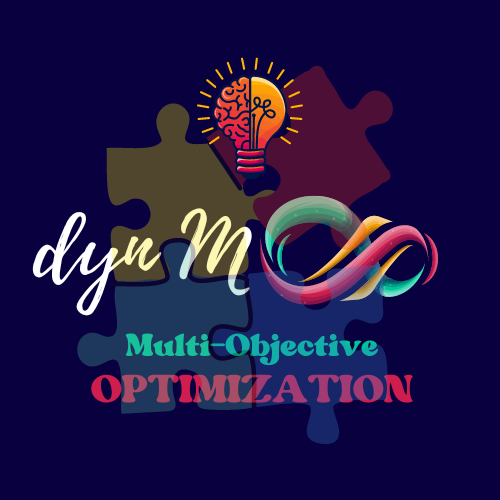

<h1 align = "center">
   
  dynMOOPs
</h1>

A mathematical implementation of the classical **Dynamic Multi-Objective Optimization Problems (`dynMOOPs`)** for practical problems
that typically involve a set of conflicting objectives. In addition, the method allows penalty on premiumization (typically for costing) and
appreciations (typically for objectives involving maximization) methods for control.

